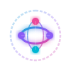

# 🌐 MiniDi Home Portal

<p align="center">
  
</p>

<p align="center">
  <a href="https://github.com/minidivn/minidi-home-ghpage/actions/workflows/deploy.yml"></a>
  <a href="https://github.com/minidivn/minidi-home-ghpage/releases"></a>
  <a href="https://pnpm.io"></a>
  <a href="https://github.com/minidivn/minidi-home-ghpage/blob/main/LICENSE"></a>
</p>

---

## 📖 Overview

The **MiniDi Home Portal** is the centralized landing page and gateway for the decentralized **MiniDi HyperGraph Network**. It operates as a serverless index, routing users to localized country knowledge graphs and domain-specific semantic spaces.

It is built as a static client-side Single Page Application using **React**, **TypeScript**, **Vite**, and **pnpm**, optimized for fast loading and deployed directly to **GitHub Pages**.

### Key Features
*   **Decentralized Portal Directory**: Links and lists child pages (e.g. `minidi-data-country.vn`, `minidi-data-country.fr`) dynamically based on configuration.
*   **Explorer Search**: Multi-domain search filter allowing users to discover country graphs and domain areas.
*   **Featured Entity of the Hour**: Randomly displays a knowledge entity from the configured featured pool on load.
*   **JSON-Configured Portal**: Completely data-driven catalog configured via `public/config.json`.

---

## 🛠️ Getting Started

### Prerequisites
*   Node.js (v20 or higher)
*   pnpm (v10 or higher)

### Setup & Installation
1.  Install dependencies:
    ```bash
    pnpm install
    ```
2.  Run development server:
    ```bash
    pnpm dev
    ```
3.  Build production bundle:
    ```bash
    pnpm build
    ```

---

## ⚙️ Configuration (`public/config.json`)

The landing page layout and domains catalog is controlled via `public/config.json`:
```json
{
  "title": "MiniDi HyperGraph Network",
  "subtitle": "Exploring decentralized knowledge graphs across countries and domains",
  "featured_pool": [
    {
      "id": "Q90",
      "repo": "minidi-data-country.fr",
      "label": "Paris",
      "desc": "Capital and largest city of France, situated on the Seine River."
    }
  ],
  "domains": [
    {
      "id": "vn",
      "type": "country",
      "name": "Vietnam",
      "emoji": "🇻🇳",
      "url": "https://minidivn.github.io/minidi-data-country.vn/",
      "github": "minidivn/minidi-data-country.vn",
      "description": "Dynasty trees, administration areas, and cultural nodes of Vietnam."
    }
  ]
}
```

---

## 🚀 Deployment (GitHub Actions)

This repository includes automatic deployment to GitHub Pages. Pushing to the `main` branch compiles assets and updates the page instantly.

*   **Production URL**: [https://minidivn.github.io/minidi-home-ghpage/](https://minidivn.github.io/minidi-home-ghpage/)

---

## 🗺️ Future Roadmap

*   **⚡ Interactive Graph Visualizations**: Render 2D/3D interactive force-directed canvas graphs representing relationships across domain nodes directly on the homepage portal.
*   **✍️ Embedded Client Code Editor**: Edit configurations, layout, and dictionary bridges in real-time, enabling collaborative editing directly from the browser window.
*   **💬 Community Agent Chat**: Embedded real-time messaging console linking users and autonomous crawlers/agents to discuss knowledge extraction tasks.
